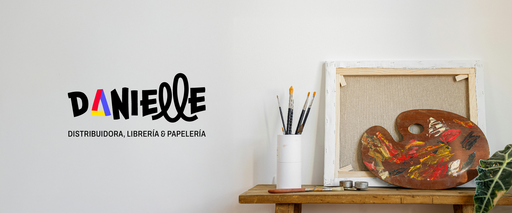

# Danielle Distribuidora — Identity Redesign & Digital Strategy

This project represents the comprehensive transformation of Danielle Distribuidora, an established wholesale stationery brand, moving towards a modern, flexible, and digitally functional identity.

🎯 The Challenge
Amidst an expansion phase and the opening of new retail locations, the goal was to modernize a rigid, dated brand image without losing its market recognition. The objective: transform the brand into a vibrant, creative, and approachable identity capable of engaging both wholesale clients and retail consumers.

💻 Digital Initiative (UX/UI & Front-End Implementation)
As an end-to-end solution, I redesigned the website from scratch, optimizing its architecture for the digital ecosystem. The project followed a "Design in the Browser" workflow, allowing active iteration directly on code based on real user experience:

* **Structure & Hierarchy:** A conversion-focused landing page prioritizing visual clarity, featuring intuitive categorization across core business sectors (Stationery, Toys, Wholesale).
* **Responsive Architecture:** Engineered with a mobile-first approach, ensuring the brand identity retains its visual impact and layout integrity across all viewport sizes.
* **Custom Maquetation with Tailwind CSS:** Built entirely from scratch without pre-made templates, prioritizing highly optimized code and a unique digital aesthetic.
* **Fluid Interactions:** Technical refinement utilizing AI tools (Antigravity) to achieve smooth transitions and high-quality fade-in entry effects.

🎨 Visual Identity & Concept
* **Brand Evolution:** Redesigned the iconic triangle asset to inject dynamism and modernity, turning it into the anchor of a flexible visual system.
* **Design System:** Defined a cohesive color palette and a cheerful, unconstrained typographic selection, perfectly balancing programmatic solidness with brand approachability.
* **Organic Assets:** Created custom free-form visual elements to reinforce a creative, non-structured studio vibe.

🛠️ Tech Stack & Tools
* **Design & Systems:** Figma, Adobe Illustrator
* **Development:** HTML5, CSS3, Tailwind CSS 4, Vanilla JavaScript
* **Iconography:** Phosphor Icons

🚀 Live Demo
✨ Explore the live experience here: [Danielle Distribuidora — Live Demo](https://mili-martinez.github.io/danielle-distribuidora/)

